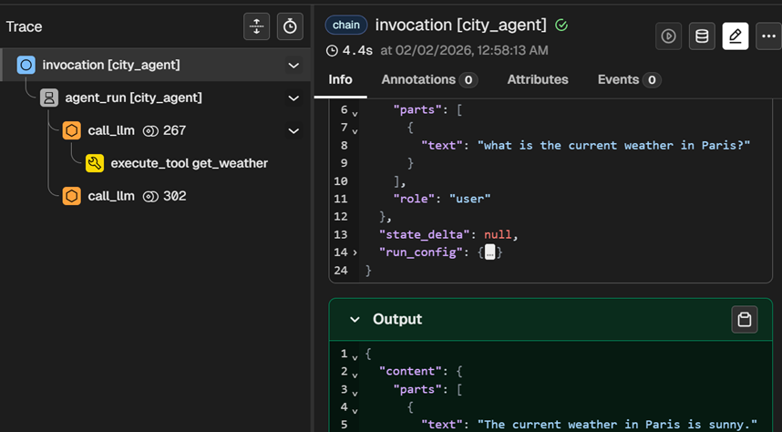

# Monitoring and Observability

To ensure reliability, transparency, and continuous improvement of the Enterprise Express Agent (EEA), we implement a robust monitoring and observability strategy. This system tracks agent creation, execution lifecycles, and detailed LLM interactions.

## Architecture

We utilize a two-pronged approach:
1.  **Real-time Observability**: Using **Arize Phoenix** for deep inspection of LLM traces, token usage, and tool execution.
2.  **Persistent History**: Using **PostgreSQL** to store long-term records of user threads, run history, and configurations.

## Observability with Arize Phoenix

We leverage [Phoenix](https://phoenix.arize.com/) (an open-source observability platform) integrated directly with Google ADK via OpenTelemetry.

### Why Phoenix?
- **Full Tracing**: Automatically captures every agent run, tool call, and model request.
- **Token Usage**: Tracks input/output tokens to monitor costs.
- **Performance**: Visualizes latency and identifies bottlenecks in tool execution.
- **Evaluation**: Allows for dataset-based evaluation of agent performance.

## Logging

In addition to tracing, the EEA Backend utilizes standard structured logging for infrastructure-level events (Auth failures, system errors).

- **Format**: JSON-structured logs for ingestion using standard log aggregators.
- **Levels**:
    - `INFO`: Lifecycle events (Agent Start/Stop).
    - `ERROR`: System failures (Database disconnects, SaaS API timeouts).
