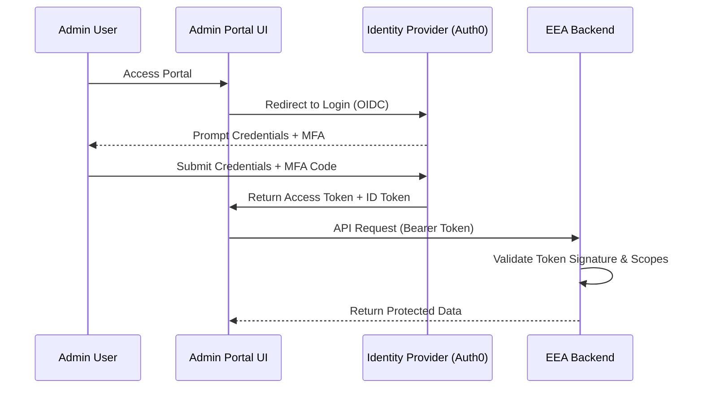

# Admin Portal Security

The Admin Portal is the high-privilege control plane for creating and managing agents and connectors. Access to this portal is strictly controlled through centralized identity management.

## Key Features
- **Identity Provider (IdP)**: Centralized user management via Auth0 or FusionAuth.
- **MFA Enforcement**: Mandatory Multi-Factor Authentication for all admin accounts.
- **RBAC**: Granular roles (Enterprise Admin, Workspace Admin) to limit exposure.

## Authentication Flow

