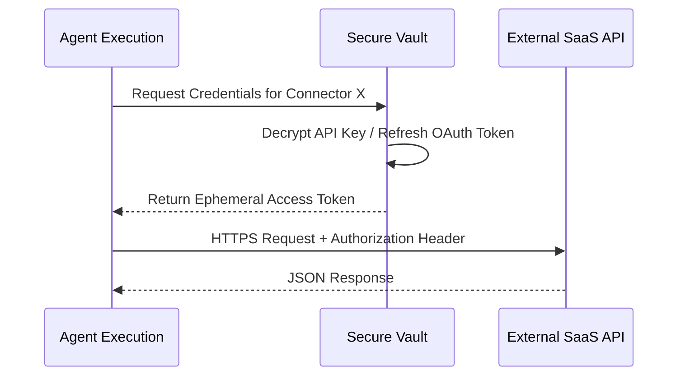

# Connector Security

Connectors are the secure tunnels through which Agents interact with external APIs, MCP Servers, and even sub-agents. 

## Key Features
- **Encryption at Rest**: All credentials (API Keys, OAuth Tokens) are encrypted in the database.
- **Least Privilege**: Connectors are scoped to specific operations defined in the OpenAPI spec.
- **Token Management**: Automated OAuth2 token refresh workflows.

## Connector Execution Flow

API or MCP servers may define their own authentication schemes such as API keys, username/password, or OAuth2. The system automatically determines the required authentication scheme and invokes the tool accordingly. The diagram below illustrates the flow for a connector requiring OAuth2 authentication.

