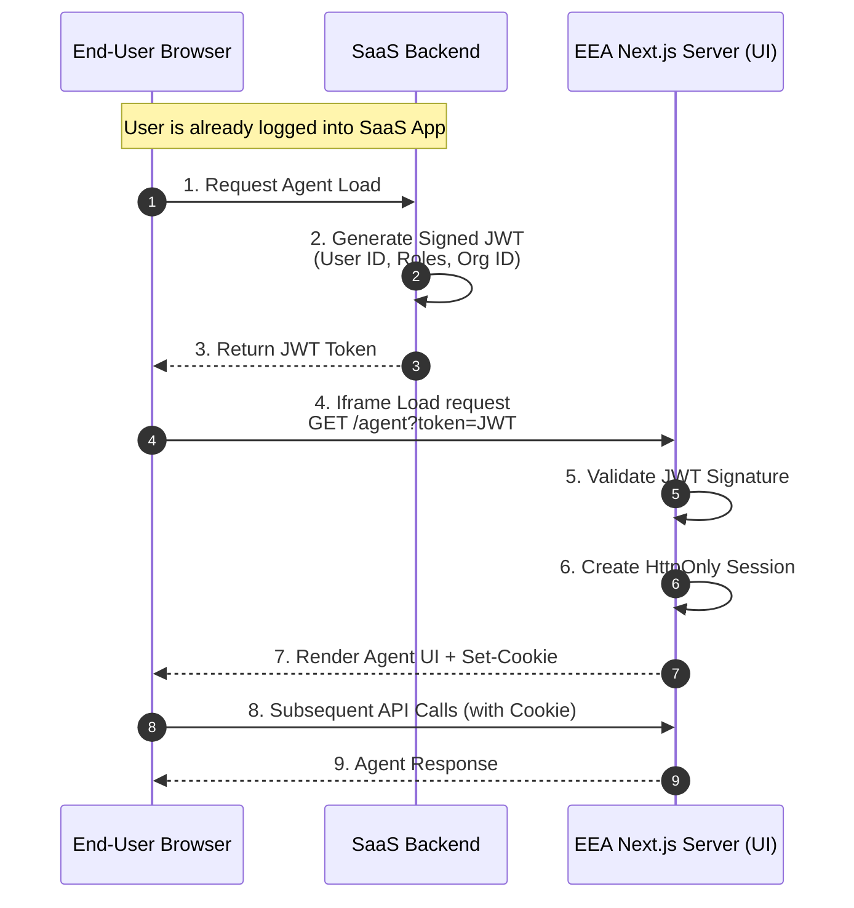

# End-User Authentication

To support seamless embedding within SaaS applications (via IFrame) while maintaining high security, EEA uses a **Server-Side Token Handoff** pattern.

## Key Features
- **No Third-Party Cookies**: Works in all modern browsers with strict privacy settings.
- **Role-Based Access**: Uses Federated Identity where the SaaS Application creates the user context.
- **Short-Lived Tokens**: Initial handoff tokens expire in seconds to prevent replay attacks.

## Token Handoff Flow

## Authorization Strategy
Permission to access specific agents is managed via **Scopes**:
1. **SaaS Role**: User has role `Finance_Manager` in SaaS App.
2. **Token Claim**: JWT includes `roles: ["Finance_Manager"]`.
3. **Agent Config**: "Finance Agent" requires scope `Finance_Manager`.
4. **Access Grant**: EEA-UI grants access based on the match.
