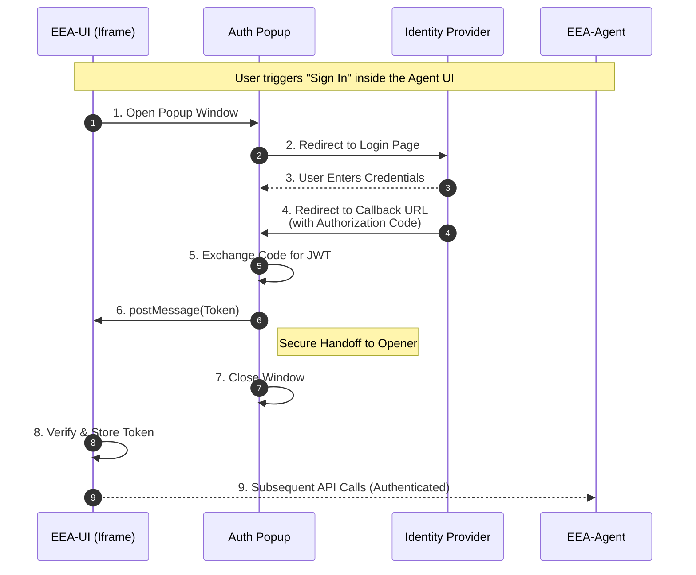

# End-User Authentication

The EEA-UI authenticates end-users via **OAuth2**, using the specific configuration defined for each Agent. To ensure compatibility with modern browser security policies (such as Iframe restrictions and third-party cookie blocking), this OAuth flow is conducted via a **secure popup window**.

### Agent Configuration
Each Agent is configured with the following OAuth2 parameters:
- **Authentication Server** (IdP Authority)
- **Client ID & Client Secret**
- **Tenant / Domain**
- **Redirect URI**: Pointing to the EEA-UI callback endpoint (e.g., `/auth/callback`).

### Implementation Strategy
The authentication process relies on a dedicated route in the EEA-UI Next.js application:

1.  **Server-Side**: The callback route receives the authorization code, exchanges it securely for access tokens, and validates the resulting JWT.
2.  **Client-Side**: The page communicates the result back to the main EEA-UI Iframe via `window.opener.postMessage` and immediately closes the popup.

## Authentication Flow

## Security Considerations
1. **Origin Check**: The Popup explicitly validates `window.opener.origin` before handing off the token to ensure it is speaking to the legitimate Agent UI.

2. **Bypassing Cookie Blocking**: By handing off the token directly via `postMessage`, the IFrame can store the token in memory or Session Storage. This bypasses modern browser restrictions on "Third-Party Cookies" that often block IFrames from reading cookies set by popups.

